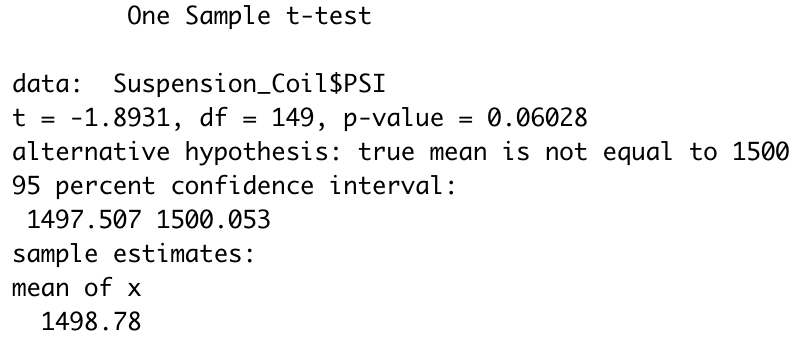

# **MechaCar STATISTICAL ANALYSIS**

## ***OVERVIEW***

### The purpose of this analysis is to provide AutosRUs with insightful statistical information in order for the manifacturing team to be able to help manage the problems currently being experienced in their newest prototype: MechaCar.

## ***Linear Regression to Predict MPG***

### Based on the above results we can address the following questions:

### **1. Which variables/coefficients provided a non-random amount of variance to the mpg values in the dataset?**
#### The vehicle length, the ground clearance and the intercept have a significant impact on the mpg.

### **2. Is the slope of the linear model considered to be zero? Why or why not?**
#### No, because in order for the slope to be 0 there needs to be no linear relationship with any variable, which is not our case.

### **3. Does this linear model predict mpg of MechaCar prototypes effectively? Why or why not?**
#### Yes, we can consider the linear model as effective because the r-squared value 0f 0.7149 means that 71.5% of the variablility of the mpg is explained by the linear model. Also, the p-value is much smaller than the significance level of 0.05%.

## ***Summary Statistics on Suspension Coils***

### Below images will explain the following question: The design specifications for the MechaCar suspension coils dictate that the variance of the suspension coils must not exceed 100 pounds per square inch. Does the current manufacturing data meet this design specification for all manufacturing lots in total and each lot individually? Why or why not?

#### The manufacturing lots in total does complu with the manufacturing specifications as we can appreciate in the image below, the variance of the total lots is 62.3:

#### On the contrary, if we check each manufacturing lot individually, we can see that lot 3 does not comply with manufacturing specification since its variance is 170.3 as we can see in the below image:

## ***T-Tests on Suspension Coils***

### Below images will show the T-Tests perfomed on all manufacturing lots as well as each individual lots:

#### All lots T-Test results show that the mean for all lots together is statistically similar to the population mean, since the p-value is above the significance level of 0.05 percent, as we can see in the following image:

#### T-Test results for Lot1 show that its mean is statistically similar to the population mean, since the p-value is above the significance level of 0.05 percent, as we can see in the following image:

#### T-Test results for Lot2 show that its mean is statistically similar to the population mean, since the p-value is above the significance level of 0.05 percent, as we can see in the following image:

#### T-Test results for Lot3 show that its mean is statistically different to the population mean, since the p-value is below the significance level of 0.05 percent, as we can see in the following image:

### As we can appreciate from above test resutls, Lot3 is the only one that its mean is statistically different than the one from the population.

## ***Study Design: MechaCar vs Competition***

### Thinking of a statistical study that can quantify how MechaCar against the competition, we definitely need to use an ANOVA Test, we need to look after the following considerentions:

#### The metrics to be used in the test need to correspond to the ones of most interest for the consumers, there are many metrics in the market but we will focus in the following 4: combined fuel efficiency, horse power, maintenance cost and safety rating.

#### The null and alternative hypotheses will be the following:
####    H0: The means of all competitors are equal for all the metrics
####    Ha: The means of MechaCar are superior in all the metrics

#### The statistical test to use as mentioned above, would be the ANOVA test because it allows us to make a comparison across more than two samples or groups and we want to compare MechaCar with at least 5 different competitors.

#### In order to perform the test we need to get a representative sample of the 5 different competitors about the four metrics we mentioned above, so we can be able to get our statics information about the mean of the fuel efficiency, horse power, maintenance cost and safety rating for all competitors, including MechaCar.

